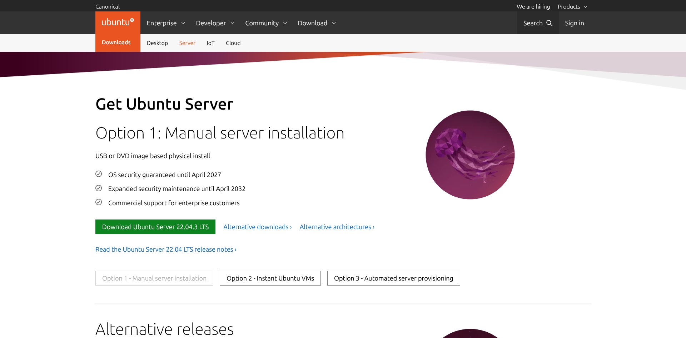
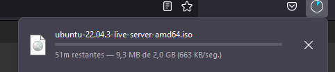
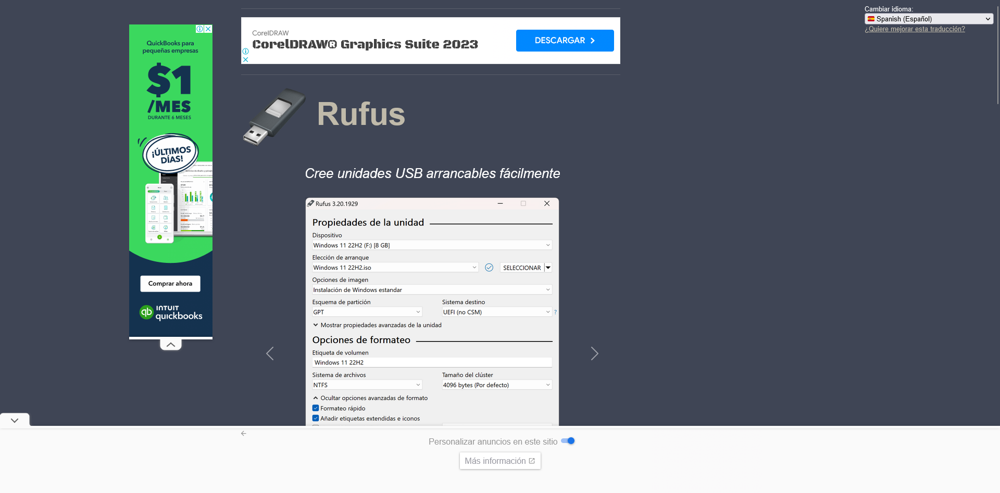
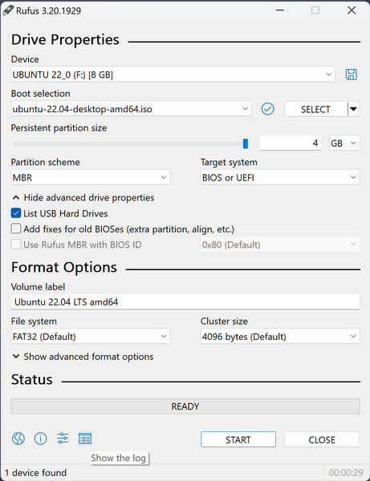

### Guía de instalación para Ubuntu Server utilizando Rufus para crear una unidad USB booteable desde Windows. 

### Instalación de Ubuntu Server con Rufus mediante USB Booteable

#### Paso 1: Descargar Ubuntu Server

1. Ve al sitio web oficial de Ubuntu Server: [https://ubuntu.com/download/server](https://ubuntu.com/download/server)

2. Descarga la versión más reciente de Ubuntu Server que sea compatible con tu hardware. Generalmente, se recomienda la versión LTS (Soporte a Largo Plazo) para la estabilidad.
Esta descarga es una

3. Elige la ruta que desees y automaticamente comenzará la descarga un archivo de imagen terminado en la extension `.iso`

#### Paso 2: Descargar Rufus

1. Ve al sitio web oficial de Rufus: [https://rufus.ie/](https://rufus.ie/) en el lenguaje en español.

2. Descarga la última versión de Rufus para Windows.

#### Paso 3: Crear una unidad USB booteable con Rufus

1. Inserta la unidad USB en tu computadora.

2. Formatear la USB a utilizar en formato FAT32 antes de ejecutar Rufus

3. Ejecuta la aplicación Rufus

4. En la sección "Dispositivo" en Rufus, selecciona tu unidad USB de la lista desplegable.

5. En la sección "Elección de arranque" selecciona el archivo `.iso` que descargaste anteriormente 

4. En la sección "Esquema de partición", elige "Tabla de particiones MBR" si tu computadora usa BIOS o "GPT" si usa UEFI. La mayoría de las computadoras modernas usan UEFI, así que verifica tu configuración antes de continuar.

5. En la sección "Sistema de archivos", selecciona "FAT32".

6. En la sección "Tamaño de unidad de asignación", deja el valor predeterminado.

7. En la sección "Etiqueta del volumen", puedes ingresar un nombre para la unidad si lo deseas.

8. En la sección "Formato rápido", asegúrate de que esté marcada la opción "Crear una unidad de arranque con" y selecciona "ISO Image" en el menú desplegable.

10. Verifica que todo esté configurado correctamente y luego haz clic en "Empezar" en la parte inferior de la ventana de Rufus.

11. Rufus advertirá que todos los datos en la unidad USB se eliminarán. Si estás seguro de que has respaldado cualquier dato importante en la unidad USB, haz clic en "Aceptar" para continuar.

12. Rufus comenzará a crear la unidad USB booteable. Esto puede llevar algunos minutos.

#### Paso 4: Instalar Ubuntu Server

1. Una vez que Rufus haya terminado de crear la unidad USB booteable, retira la unidad USB de tu computadora.

2. Reinicia tu computadora y configura la secuencia de arranque para arrancar desde la unidad USB. Puedes hacerlo generalmente presionando una tecla como `F2, F12, Delete o ALT` para Mac Pro durante el proceso de arranque y seleccionando la unidad USB como dispositivo de arranque.

3. Cuando el instalador de Ubuntu Server se inicie, sigue las instrucciones en pantalla para configurar la instalación. Puedes seleccionar las opciones de idioma, teclado, zona horaria, etc.

4. Durante la instalación, se te pedirá que ingreses una contraseña para el usuario "root" (superusuario) y que configures un usuario y contraseña para el sistema.

6. Una vez que la instalación haya terminado, retira la unidad USB y reinicia tu computadora. Ubuntu Server debería arrancar desde el disco duro.

# Enlaces de referencia
https://rufus.ie/es/
https://ubuntu.com/download/server